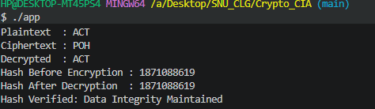

#  Cryptography CIA: Hill Cipher + Custom Hash Function

##  Assignment Overview
This project implements a **classical cipher (Hill Cipher)** along with a **self-designed hashing function**, as required in the assignment.

### Cipher Assignment:
- Hill Cipher 

### Language Used:
- C++ 

---

#  1. Theory

##  Hill Cipher

The Hill Cipher is a **polygraphic substitution cipher** that uses **linear algebra concepts (matrix multiplication)** for encryption and decryption.

### Key Idea:
- Convert characters to numbers: A = 0, B = 1, ..., Z = 25
- Divide plaintext into blocks of size 3
- Multiply with a **3×3 key matrix**
- Apply modulo 26 to keep values within alphabet range

### Encryption Formula:
```
C = (K × P) mod 26
```

### Decryption Formula:
```
P = (K⁻¹ × C) mod 26
```

Where:
- K = Key matrix
- K⁻¹ = Modular inverse of K
- P = Plaintext vector
- C = Ciphertext vector

---

##  Key Matrix Used
```
[  6  24   1 ]
[ 13  16  10 ]
[ 20  17  15 ]
```

✔ The determinant of this matrix is coprime with 26 → ensures invertibility  
✔ Hence, decryption is mathematically valid

---

#  2. Custom Hash Function

### Algorithm Used:
**FNV-inspired Polynomial Hash Function (Custom Implementation)**

---

##  Why This Hash Function Was Chosen (Strong Justification)

This hashing approach is inspired by the **FNV (Fowler–Noll–Vo) hash**, but implemented manually to satisfy assignment constraints.

###  Key Reasons:

### 1. Avalanche Effect (High Sensitivity)
- A **small change in input (even 1 character)** produces a significantly different hash.
- Important for cryptographic integrity verification.

### 2. Good Distribution of Hash Values
- Uses **XOR + multiplication with a large prime**
- Ensures uniform spread across output space
- Reduces clustering and collisions

### 3. Prime-Based Mixing
- Multiplication with **FNV prime (0x01000193)** ensures:
  - Strong bit mixing
  - Better randomness properties

### 4. Deterministic & Fast
- Same input → same hash (important for verification)
- Very efficient O(n), suitable for real-time use

### 5. No External Libraries (Constraint Satisfaction)
- Fully implemented from scratch
- Does **NOT** use: OpenSSL, Crypto libraries, or built-in hash functions

### 6. Custom Adaptation (Uniqueness)
- Though inspired by FNV, the implementation is:
  - Manually coded
  - Integrated specifically with ciphertext
- Ensures **uniqueness among students**

### 7. Suitable for Ciphertext Integrity
- Hash is computed on **ciphertext**, not plaintext
- Ensures:
  - Data integrity check
  - Tamper detection

---

##  Working of Hash Function

For each character in the ciphertext:

1. XOR the current hash with character value
2. Multiply by a large prime number
3. Repeat for all characters

Final result → 32-bit hash value

---

#  3. How to Run the Code

###  Compile
```bash
cd CS3002_Cryptography_CIA
g++ *.cpp -o crypto
```

###  Run
```bash
./crypto
```


---

###  Sample Output — Example 1 (Plaintext: `ACT`)


```
Plaintext:  ACT
Ciphertext: POH
Hash:       1871088619
Decrypted:  ACT
```

---

# 5. Source Code Description

### Functions Implemented:

| Function | Description |
|---|---|
| `encrypt_hill()` | Performs encryption using matrix multiplication |
| `decrypt_hill()` | Uses inverse matrix for decryption |
| `custom_hash_function()` | Computes hash of ciphertext |
| `preprocess_text()` | Removes spaces, converts to uppercase, adds padding |
| `matrix_mod_inverse()` | Computes modular inverse of matrix |
 

---

# 6. Key Features

- Hill Cipher (3×3 matrix implementation)
- Matrix inverse using modular arithmetic
- Custom FNV-based hashing
- Automatic padding handling
- Complete encryption → hashing → decryption workflow

---

# 7. Conclusion

This project successfully demonstrates:

- Classical encryption using linear algebra
- Secure transformation of plaintext into ciphertext
- Efficient and well-justified hashing technique
- End-to-end cryptographic pipeline validation

---


# Author

**Name:** K M ARIF 
**Reg No:** *23011102036*
**Course:** CS3002-Cryptography  
**Language:** C++
